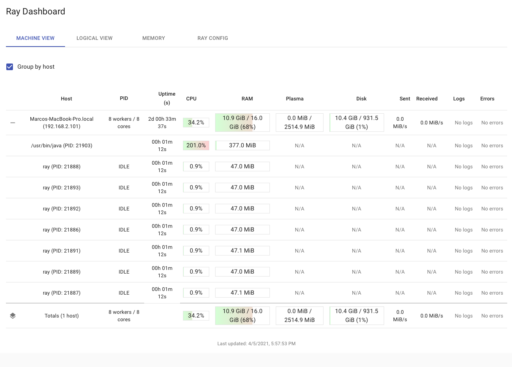
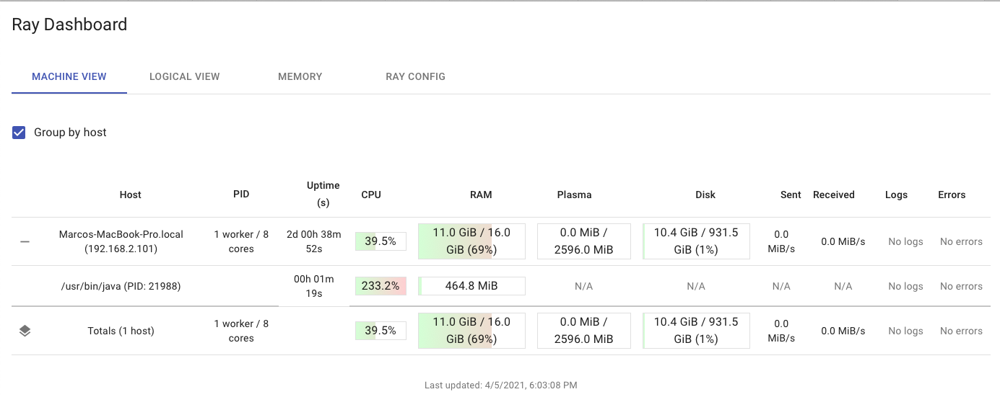
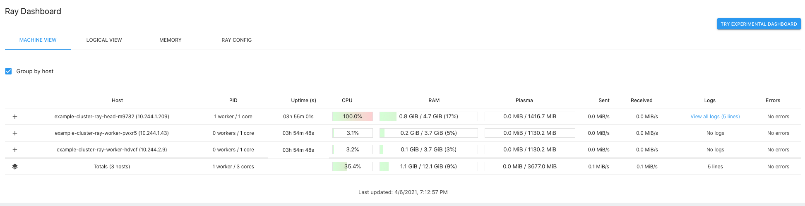

## Repo organization 

This project test the cross language support for Java in Ray. 

- `ScalaSparkTest` project is a small scala project using sbt, that calculates the value of PI using Spark. This project is assembled in a fat `.jar`.

- `script_x.py`: A script that executes a java class code from the assembled `jar` as a Ray Actor using python code. 

--------

## Running the python scripts

- Is required to `assembly` the scala project and generate the fat `scala-pi.jar`. 

- Copy the `ScalaSparkTest/target/scala-2.11/scala-pi.jar` to repository root folder. 

- Activate the poetry virtual environment for python dependencies. 

- Execute the python scripts. 

--------

## Testing the scripts in a single laptop

### `script_one.py`

1. Execute script: `$ python script_one.py`

The Ray dashboard state: 



Console output: 

```
>>> python script_one.py 
2021-04-05 17:56:39,478 INFO services.py:1172 -- View the Ray dashboard at http://127.0.0.1:8265
Pi is: 3.141501872
```

### `script_two.py` 

1. Init ray from the command line: `$ ray start --head --port=6379`
2. Execute script: `$ python script_two.py`

The Ray dashboard state:



Console output: 

```
>>> python script_two.py 
2021-04-05 18:01:49,644 INFO worker.py:654 -- Connecting to existing Ray cluster at address: 192.168.2.101:6379
Pi is: 3.1414846
```

-------

## Running the application in the head node from the Ray cluster.  

It's possible to [setup](https://docs.ray.io/en/master/cluster/kubernetes.html#the-ray-kubernetes-operator) 
a Ray cluster in Kubernetes with Autoscaler.

For that, the following are required in the kubernetes cluster: 

- The `RayCluster` custom resource must be [configured](https://github.com/ray-project/ray/blob/ray-1.2.0/python/ray/autoscaler/kubernetes/operator_configs/cluster_crd.yaml).
- The _Operator_ pod must be [started](https://github.com/ray-project/ray/blob/ray-1.2.0/python/ray/autoscaler/kubernetes/operator_configs/operator.yaml).

After the custom resource and the operator are configured, is possible to launch the cluster. 

The folder `run-on-head` contains the cluster [definition](https://github.com/MarcoAlejandro/cross_language_ray_experiment/blob/main/run-on-head/example-cluster.yaml).  
The container Docker image used for the head/worker nodes is a [custom Ray image](https://github.com/MarcoAlejandro/cross_language_ray_experiment/blob/main/run-on-head/Dockerfile) ([Dockerhub](https://hub.docker.com/repository/docker/kada9001/ray-custom-image)) packaged with Java install and the fat `jar` of the `ScalaSparkTest` project. 
The cluster can be started using: 

```
kubectl -n ray apply -f run-on-head/example-cluster.yaml
```

My cluster:

```
$ kubectl -n ray get pods
NAME                               READY   STATUS    RESTARTS   AGE
example-cluster-ray-head-m9782     1/1     Running   0          3h48m
example-cluster-ray-worker-hdvcf   1/1     Running   0          3h47m
example-cluster-ray-worker-pwxr5   1/1     Running   0          3h47m
ray-operator-pod                   1/1     Running   0          7d22h
```

The folder `run-on-head` also contains a driver in [`script.py`](https://github.com/MarcoAlejandro/cross_language_ray_experiment/blob/main/run-on-head/script.py) for [running the program in the head node](https://docs.ray.io/en/master/cluster/kubernetes.html#running-the-program-on-the-head-node). 
The driver configures the Java code search path. 

The program can be executed on the cluster to test that the cluster is capable of running Java code using python successfuly: 

```
# Copy the ray program driver to the head node
kubectl -n ray cp run-on-head/script.py example-cluster-ray-head-m9782:/home/ray

# Exec the driver: 
kubectl -n ray exec example-cluster-ray-head-m9782 -- python script.py

# Console Output: 
2021-04-06 16:12:37,121 INFO worker.py:654 -- Connecting to existing Ray cluster at address: 10.244.1.209:6379
Pi is: 3.141585288
```

The cluster dahsboard while executing the Spark example: 



-----

## Running the application Using a Kubernetes Job


-----

## Running the application using the Ray Client  API